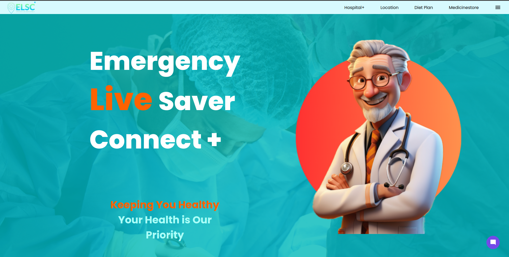

<h1> Capstone project </h1>
<h2> Made by MOHIT-IITP for the Uni(IITP)</h2>
<h4>"Emergency Live Saver Connect" is a website designed to assist users in locating nearby hospitals and medical facilities. The platform aims to provide quick and efficient access to emergency medical services, ensuring users can find the nearest healthcare resources in critical situations.</h4>
</img>